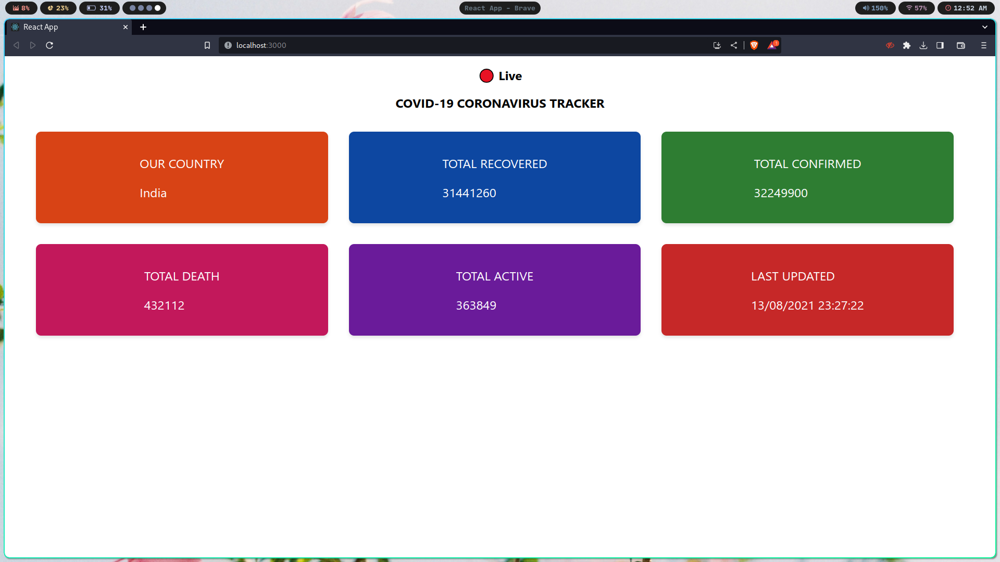

# 🌈 COVID-19 Case Tracker

> ⚠️ Please note: This project used to work and fetch live COVID-19 data, but unfortunately, the COVID-19 pandemic has passed, and the API used for data retrieval is no longer active. However, this remains a cool and colorful project showcasing React skills and data fetching using APIs.

## Overview

This Beautiful COVID-19 Tracker is a React-based web application that provided live updates and statistics for COVID-19 cases in India. It fetched data from a public API and displayed it in a visually appealing and user-friendly manner.

## Project Features

- Live tracking of COVID-19 cases, recoveries, and deaths in India.
- Colorful and visually appealing design.
- Responsive layout for a seamless experience on various devices.

## How to Run

To run this project locally, follow these steps:

1. Clone the repository to your local machine.
2. Install the required dependencies using `npm install`.
3. Run the development server using `npm start`.
4. Open your browser and navigate to `http://localhost:3000`.

## Technologies Used

- React.js: Frontend JavaScript library for building user interfaces.
- CSS: For styling and layout design.
- Fetch API: To fetch data from the COVID-19 data API.

## Project Status

As mentioned earlier, this project is no longer active due to the COVID-19 pandemic being over and the data API no longer available. However, you can still explore the code and see how the live data was fetched and displayed beautifully.

## Acknowledgements

This project was created as a part of a personal learning journey with React and data fetching. Special thanks to the COVID-19 India API for providing live data during the pandemic.

Feel free to use this project as a reference or as a starting point for your own creative projects!

## License

This project is licensed under the MIT License - see the [LICENSE](LICENSE) file for details.
